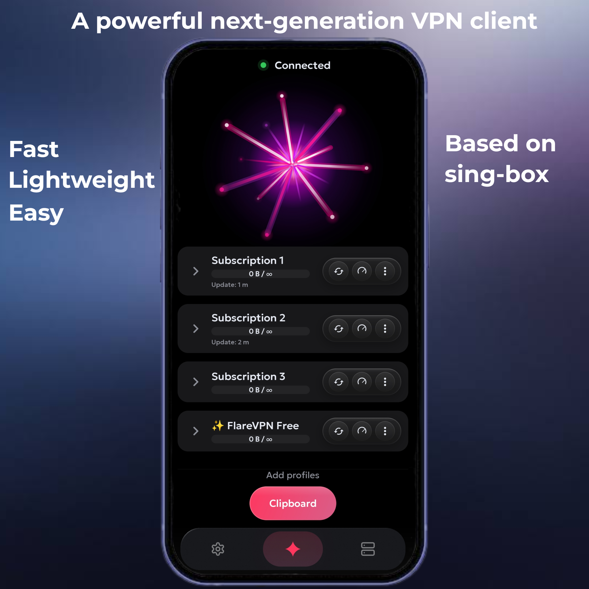
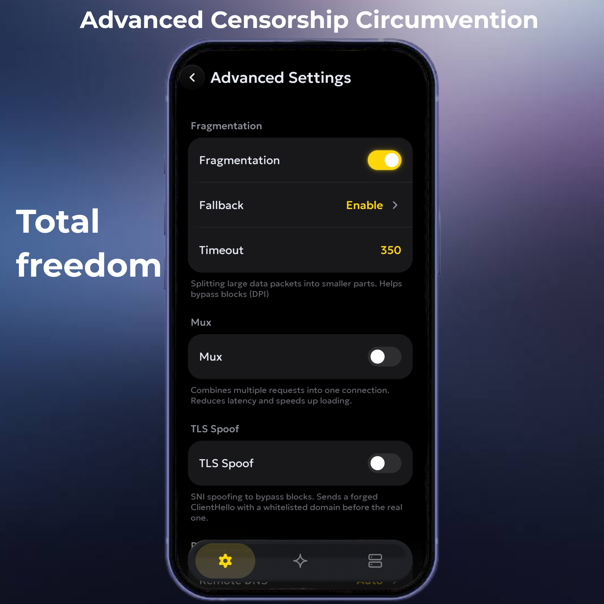
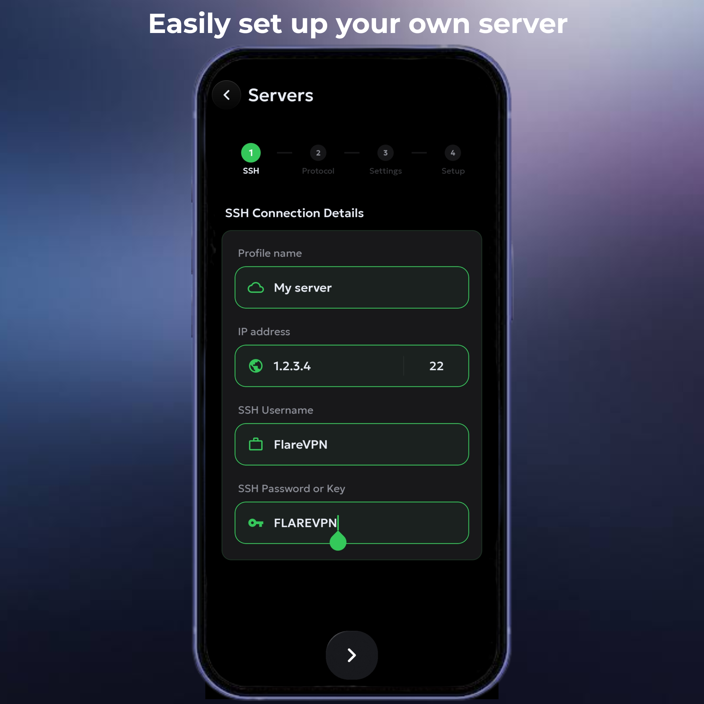
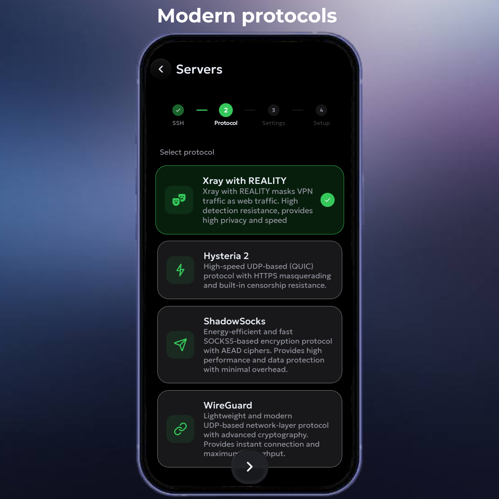
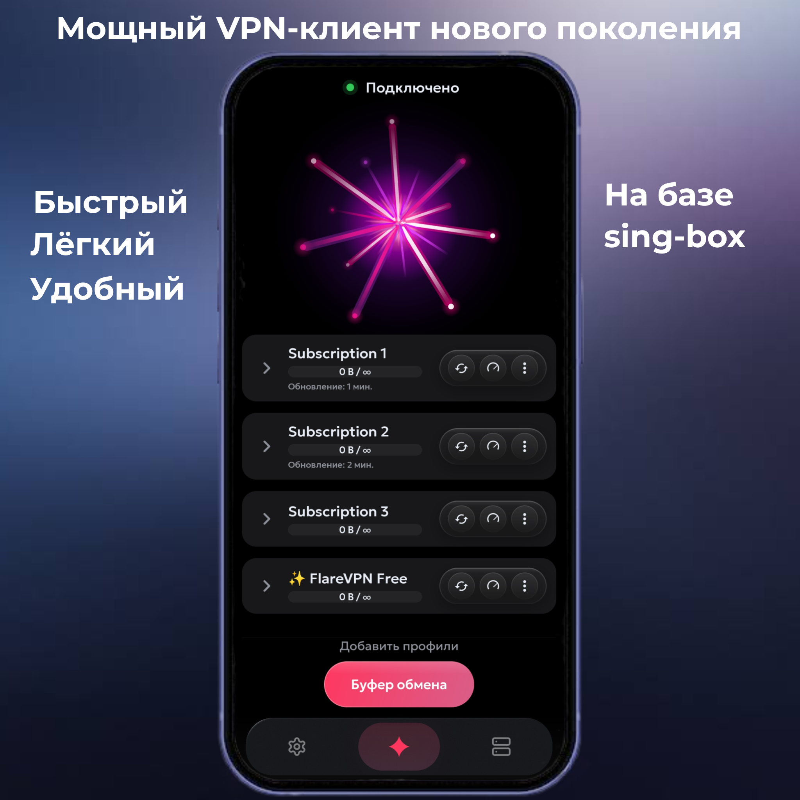
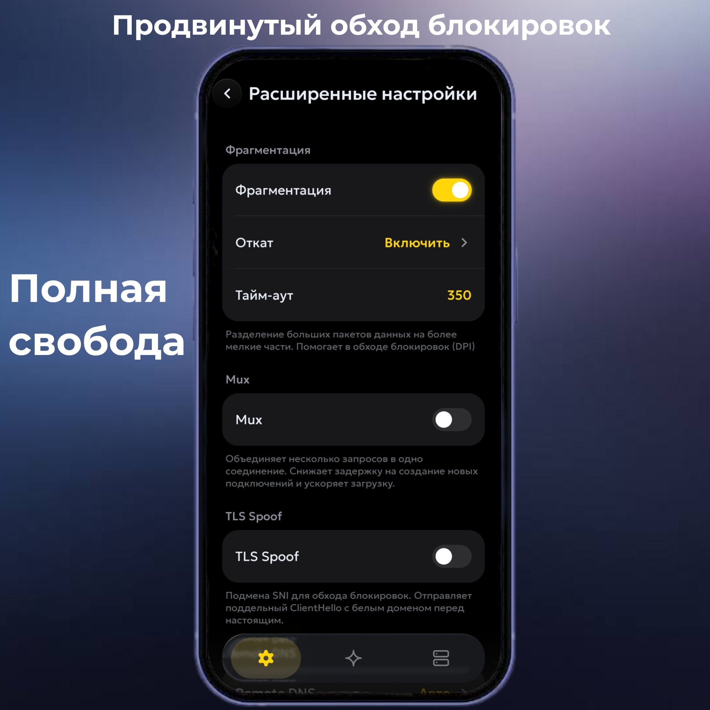
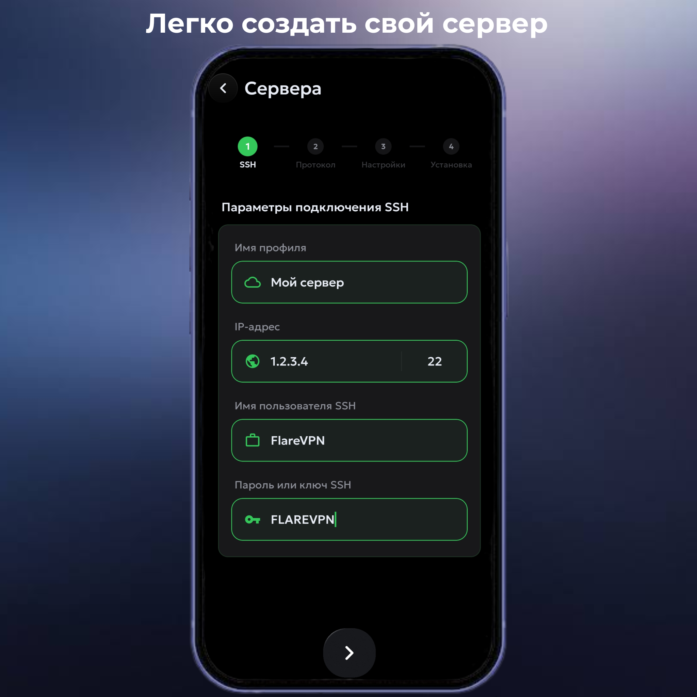
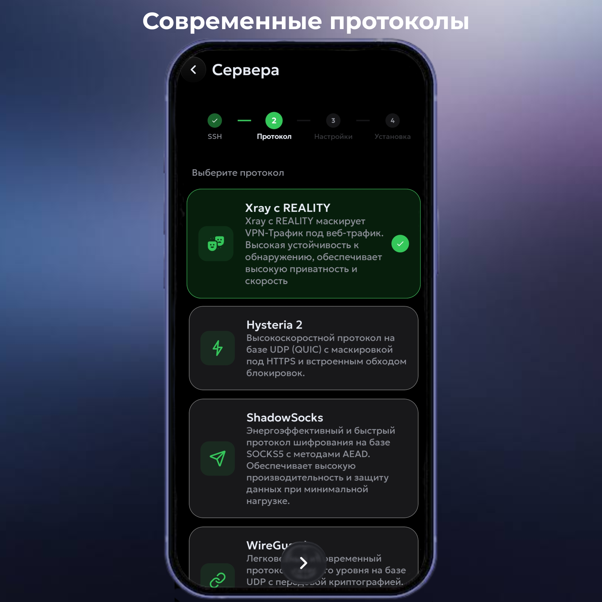

# Flare VPN

Flare is a powerful open-source VPN client designed for flexibility, security, and performance. Built on top of the robust `sing-box` core, it provides a modern interface for managing your secure tunnels.

---

## 🌍 Languages / Языки
- [English](#english-version)
- [Русский](#русская-версия)

---

## English Version

  

### 🛠 Supported Protocols
Flare supports a wide range of modern protocols, including:
- **VLESS** (Reality)
- **Shadowsocks**
- **Hysteria 2**
- And many others!

### ✨ Advanced Features
Flare offers professional-grade tunnel settings to bypass censorship and optimize your connection:
- **Fragmentation:** Split packets to evade detection.
- **Mux:** Multiple streams over a single connection for better efficiency.
- **Fake IP:** Enhance DNS performance and privacy.
- And much more to explore!

  

### 📡 Creating your own servers
FlareVPN supports the deployment and management of your own VPN servers based on the most modern and block-resistant protocols:

* **VLESS (with REALITY support)**
* **Hysteria 2**
* **Shadowsocks**
* **WireGuard**

  

  

### 🛠 Installation
1. Download `Flare.apk` from the [Releases](https://github.com/FlareSpace/FlareVPN/releases) page.
2. Install the APK on your device.
3. Grant the required permissions when the app starts.
4. **Done!** Let's get started.

### 📢 Telegram Channel
**[@FlareApp](https://t.me/FlareApp)** - Official Flare VPN news and updates.

---

## Русская Версия

  

Flare — это мощный VPN-клиент с открытым исходным кодом, созданный для обеспечения гибкости, безопасности и высокой производительности. Flare предоставляет современный интерфейс для управления вашими защищенными туннелями на базе ядра `sing-box`.

### 🛠 Поддерживаемые протоколы
Flare поддерживает широкий спектр современных протоколов:
- **VLESS** (Reality)
- **Shadowsocks**
- **Hysteria 2**
- И многие другие!

### ✨ Продвинутые функции
В Flare доступны профессиональные настройки туннелей для обхода цензуры и оптимизации соединения:
- **Фрагментация:** Разделение пакетов для обхода средств обнаружения.
- **Mux:** Мультиплексирование потоков для повышения эффективности.
- **Fake IP:** Улучшение производительности DNS и конфиденциальности.
- И еще немало других полезных опций!

  

### 📡 Создание своих серверов

FlareVPN поддерживает развертывание и управление собственными VPN-серверами на базе самых современных и устойчивых к блокировкам протоколов:

* **VLESS (с поддержкой REALITY)**
* **Hysteria 2**
* **Shadowsocks**
* **WireGuard**

  

  

### 🛠 Установка
1. Скачайте `Flare.apk` со страницы [Релизов](https://github.com/FlareSpace/FlareVPN/releases).
2. Установите APK на ваше устройство.
3. Выдайте необходимые разрешения при первом запуске приложения.
4. **Готово!** Можно пользоваться.

### 📢 Telegram-канал
**[@FlareApp](https://t.me/FlareApp)** — официальный Telegram-канал проекта Flare VPN.

---

## 📄 License
This project is licensed under the [GPLv3 License](LICENSE).
